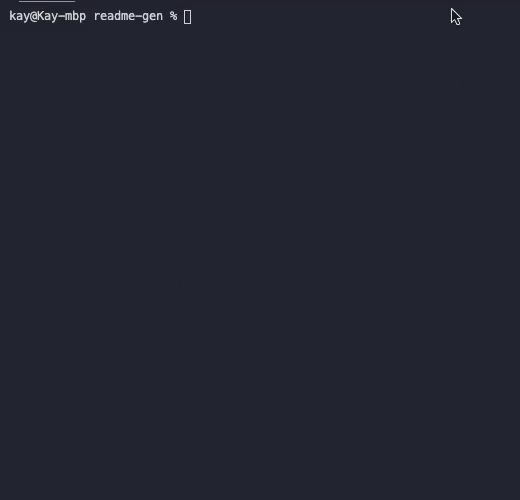
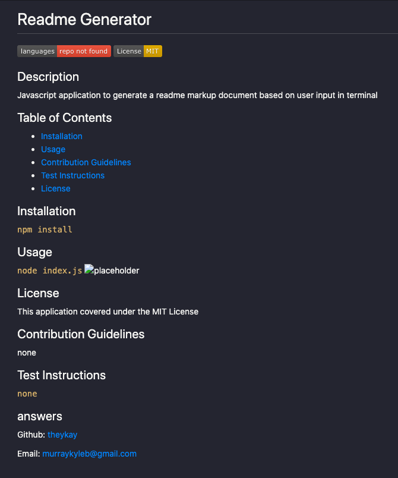

# Readme Generator

            
## Description
Javascript application to generate a readme markup document based on user input in terminal

## Table of Contents
* [Installation](#installation)
* [Usage](#usage)
* [Contribution Guidelines](#contribution-guidelines)
* [Test Instructions](#test-instructions) 
* [License](#license)

## Installation
`npm install`

## Usage
`node index.js`

## License
This application covered under the MIT License

## Contribution Guidelines
none

## Test Instructions
`none`

## answers
Github: [theykay](https://github.com/theykay)

Email: [murraykyleb@gmail.com](mailto:murraykyleb@gmail.com)
